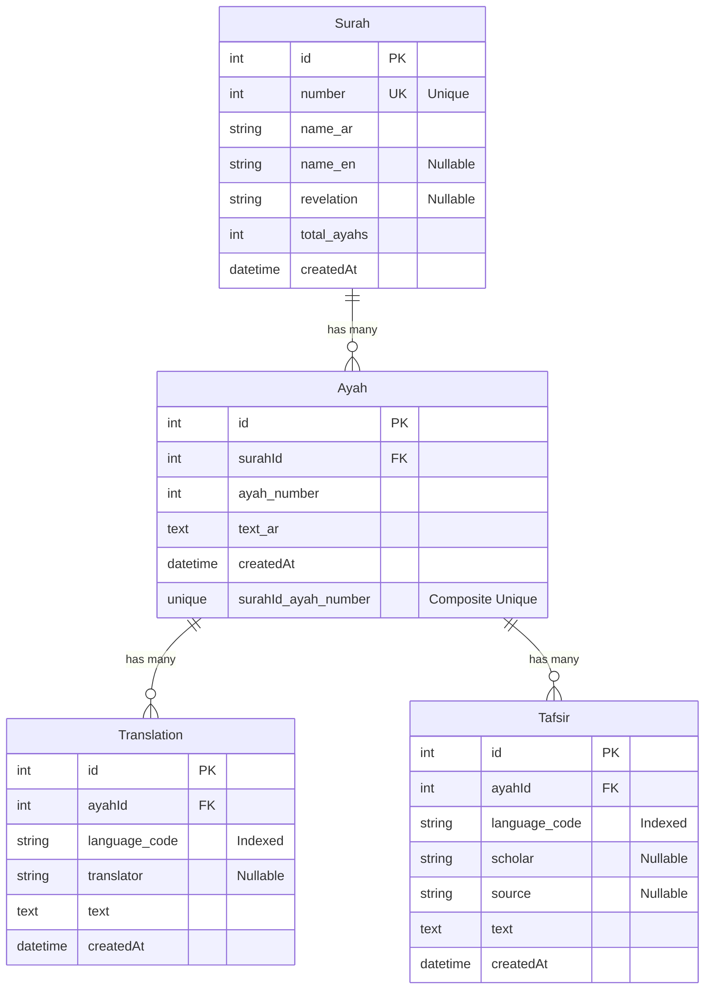

# Quran Database Schema Diagram

## Entity Relationship Diagram (Mermaid)



## Database Schema Details

### Table: `Surah`
| Column | Type | Constraints | Description |
|--------|------|-------------|-------------|
| `id` | INT | PRIMARY KEY, AUTO_INCREMENT | Unique identifier |
| `number` | INT | UNIQUE, NOT NULL | Surah number (1-114) |
| `name_ar` | VARCHAR | NOT NULL | Arabic name of the surah |
| `name_en` | VARCHAR | NULLABLE | English name of the surah |
| `revelation` | VARCHAR | NULLABLE | Place of revelation (Makkah/Madinah) |
| `total_ayahs` | INT | NOT NULL | Total number of ayahs in the surah |
| `createdAt` | TIMESTAMP | DEFAULT NOW() | Record creation timestamp |

**Relationships:**
- One-to-Many with `Ayah` (one surah has many ayahs)

---

### Table: `Ayah`
| Column | Type | Constraints | Description |
|--------|------|-------------|-------------|
| `id` | INT | PRIMARY KEY, AUTO_INCREMENT | Unique identifier |
| `surahId` | INT | FOREIGN KEY → Surah.id | Reference to parent surah |
| `ayah_number` | INT | NOT NULL | Ayah number within the surah |
| `text_ar` | TEXT | NOT NULL | Arabic text of the ayah |
| `createdAt` | TIMESTAMP | DEFAULT NOW() | Record creation timestamp |

**Unique Constraint:**
- `(surahId, ayah_number)` - Ensures each ayah number is unique within a surah

**Relationships:**
- Many-to-One with `Surah` (many ayahs belong to one surah)
- One-to-Many with `Translation` (one ayah has many translations)
- One-to-Many with `Tafsir` (one ayah has many tafsirs)

---

### Table: `Translation`
| Column | Type | Constraints | Description |
|--------|------|-------------|-------------|
| `id` | INT | PRIMARY KEY, AUTO_INCREMENT | Unique identifier |
| `ayahId` | INT | FOREIGN KEY → Ayah.id | Reference to parent ayah |
| `language_code` | VARCHAR | NOT NULL, INDEXED | Language code (e.g., 'en', 'ml') |
| `translator` | VARCHAR | NULLABLE | Name of the translator |
| `text` | TEXT | NOT NULL | Translated text |
| `createdAt` | TIMESTAMP | DEFAULT NOW() | Record creation timestamp |

**Indexes:**
- `language_code` - For faster queries filtering by language

**Relationships:**
- Many-to-One with `Ayah` (many translations belong to one ayah)

---

### Table: `Tafsir`
| Column | Type | Constraints | Description |
|--------|------|-------------|-------------|
| `id` | INT | PRIMARY KEY, AUTO_INCREMENT | Unique identifier |
| `ayahId` | INT | FOREIGN KEY → Ayah.id | Reference to parent ayah |
| `language_code` | VARCHAR | NOT NULL, INDEXED | Language code (e.g., 'en', 'ml') |
| `scholar` | VARCHAR | NULLABLE | Name of the scholar |
| `source` | VARCHAR | NULLABLE | Source of the tafsir |
| `text` | TEXT | NOT NULL | Tafsir text/explanation |
| `createdAt` | TIMESTAMP | DEFAULT NOW() | Record creation timestamp |

**Indexes:**
- `language_code` - For faster queries filtering by language

**Relationships:**
- Many-to-One with `Ayah` (many tafsirs belong to one ayah)

---

## Relationship Summary

```
Surah (1) ──────< (Many) Ayah
                        │
                        ├───< (Many) Translation
                        │
                        └───< (Many) Tafsir
```

## Example Data Flow

1. **Surah** contains basic information about a chapter
2. **Ayah** contains the Arabic text of each verse, linked to a surah
3. **Translation** provides translations of ayahs in different languages
4. **Tafsir** provides explanations/commentaries of ayahs in different languages

## Query Examples

- Get all ayahs of a surah: `SELECT * FROM Ayah WHERE surahId = 1`
- Get English translations: `SELECT * FROM Translation WHERE language_code = 'en'`
- Get Malayalam tafsirs: `SELECT * FROM Tafsir WHERE language_code = 'ml'`

